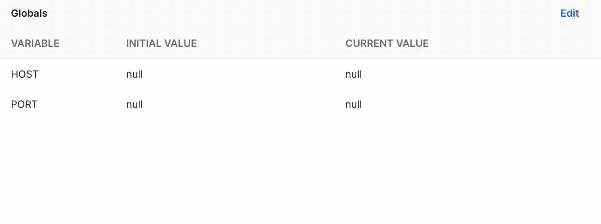
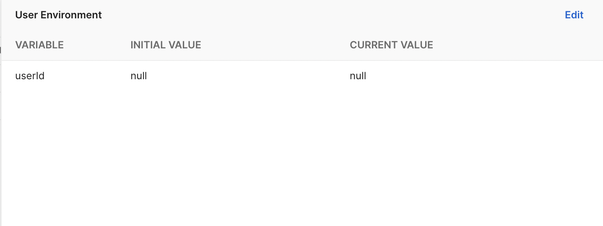

<div id="top"></div>

<h1 align="center">Node.js Express REST API MySQL JS Example</h1>

<div align="center">
  <p align="center">
    This REST API example is a basic backend application to test basic API functions with MySQL database.
  </p>
  <a href="https://www.postman.com/workspace/node-js-express-mysql-rest-api-example/overview">View Postman Files</a>
</div>

<!-- TABLE OF CONTENTS -->
<details>
  <summary>Table of Contents</summary>
  <ol>
    <li>
      <a href="#about-the-application">About The Application</a>
      <ul>
        <li><a href="#built-with">Built With</a></li>
      </ul>
    </li>
    <li><a href="#how-to-install">How To Install</a></li>
    <li><a href="#available-scripts">Available Scripts</a></li>
    <li><a href="#postman">Postman</a></li>
  </ol>
</details>

<!-- ABOUT THE APPLICATION -->

## About The Application

This REST API example is a basic backend application to test basic API functions with MySQL database.

It is built with Node.js and Express Framework with Javascript. In addition, the applications database is MySQL, with the use of mysql2 library.

In the applicaiton we can manage user data, such as create/edit/delete a user. In addition, we can get all the users in the database.

The point of this backend application is to test CRUD operations with MySQL database.

<p align="right">(<a href="#top">back to top</a>)</p>

### Built With

-   [Node.js](https://nodejs.org/en/)
-   [Express](https://expressjs.com/)
-   [Cors](https://www.npmjs.com/package/cors)
-   [MySQL2](https://www.npmjs.com/package/mysql2)

<p align="right">(<a href="#top">back to top</a>)</p>

<!-- INSTALLATION INSTRUCTIONS -->

## How To Install

**Git clone**

```
git clone https://github.com/almoggutin/Node-Express-REST-API-MySQL-JS-Example
```

**Instructions**

-   After cloning the the repository run `npm i` in order to install all the dependencies.
-   Create an env file in the root of the project named .env and fill in the follwing variables: PORT, DB_HOST, DB_PORT, DB_USERNAME, DB_USERNAME_PASSWORD, DB_NAME.
-   In the sql directory, there are sql files that you will need to execute in order to initialize the database.

<p align="right">(<a href="#top">back to top</a>)</p>

<!--  AVAILABLE SCRIPTS -->

## Available Scripts

In the project directory, you can run:

### `npm start`

Runs the app in the production mode.\
However, this script is only meant to be run when deploying the application. The application is built, where you need to setup the env variables on the machine that you will be hosting it on or on a web hosting service, unlike in development mode.

### `npm run dev`

Runs the app in the development mode.\
Open localhost on the port you decided on in the env variables to view it in the browser.

The API will reload if you make edits with the use of nodemon.

<p align="right">(<a href="#top">back to top</a>)</p>

<!-- POSTMAN -->

## Postman

If you would like to run the files locally on your machine in the postman desktop application, included in the repository, in the `postman` directory all the files so you can import them. In addition you will have to configure env variables in postman so that you will be able to test properly everything.

<div align="center">
  
  
</div>

<p align="right">(<a href="#top">back to top</a>)</p>
